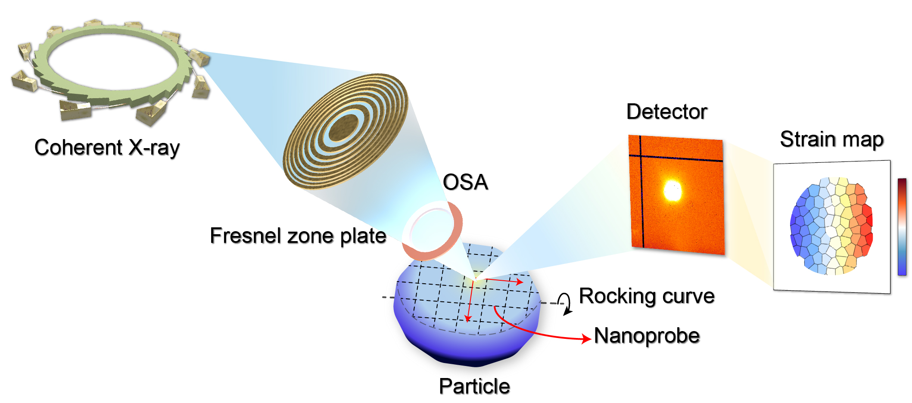
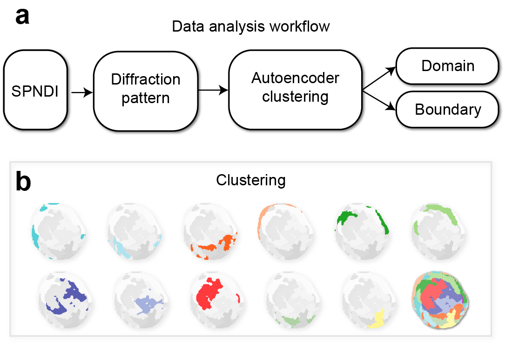

Repairing the residual intragranular defect to alleviate local lattice strain accumulation in large-size LiCoO2 crystal upon electrochemical cycling
====

## Imaging technique
The hard X-ray nanoprobe beamline [3-ID of National Synchrotron Light Source II](https://www.bnl.gov/nsls2/beamlines/beamline.php?r=3-ID) is used to perform the scanning probe nano-diffraction imaging (**SPNDI**). The experiment was performed with a 30x30 nm2 X-ray beam. The scanning step size was 50 nm, thus the pixel size of the obtained images is 50x50 nm2.

The sample was rotated over a 180o range with an XRD detector recording the diffraction pattern at each rotation angle in order to locate the target Bragg peak. A pixel array detector was then oriented to measure the strongest (101) peak. The crystal was rocked over a 2o angular range in the vicinity of the (101) Bragg peak, and a two-dimensional raster scan was conducted at each rocking angle. The local Bragg diffraction measurements were performed in sync with the raster scan, and the raster scans were repeated for a series of rocking angles with diffraction signals above the noise level.

Fig.1. Scanning Probe Nano-diffraction Imaging.

## Data Analysis
SPNDI data is first pretreated to get and strain maps pixel-wise .ply 3D diffraction patterns.
-  Strain maps are treated using `SPNDI_styatistics.ipynb` to get the mean and standard deviation value of every LiCoO2 particles. 
- The pixel-wise diffraction patterns are treated using an [AutoEncoder model](https://github.com/YijinLiu-Lab/NanoDiffractionAnalysis) reported in [Probing lattice defects in crystalline battery cathode using hard X-ray nanoprobe with data-driven modeling](https://www.sciencedirect.com/science/article/pii/S2405829721005997)
- The latent representation vectors are used as feature vector of each pixel diffraction pattern. kmeans++ are used to cluster pixels into different groups.

Fig.2. Clustering result using k-means++ algorithm.

- Clustered data such as rocking curve, mean difference are analyzed using `Cluster_analysis.ipynb`.
- The diffraction patterns of domains, boundaries, and each cluster are obtained using `Diffraction_pattern_visualization.ipynb`.